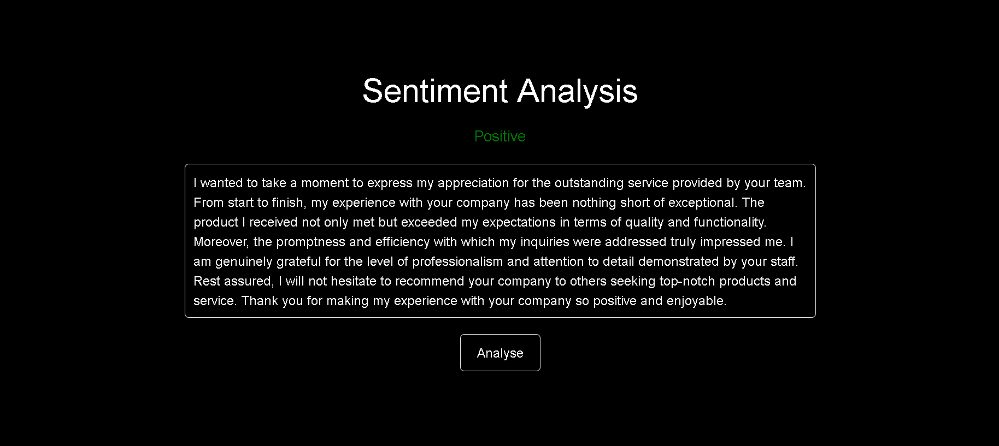
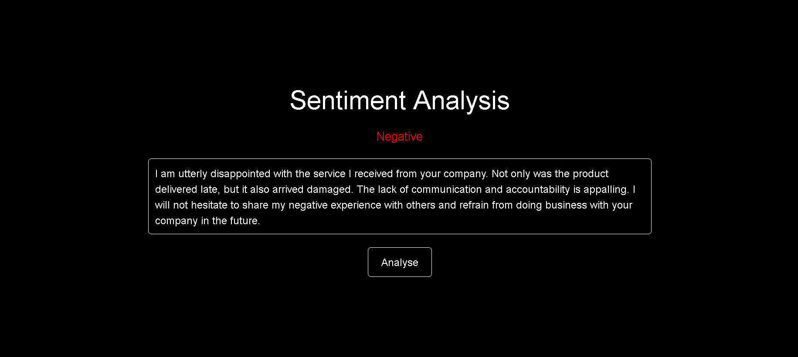

# Sentiment Analysis Web App

This is a web application built with Flask for sentiment analysis using TextBlob.

## Installation


1 - Navigate to the project directory:

```bash

cd <directory_name>
```

2 - Clone the repository:

```bash
git clone <repository_URL>
```


3 - Install dependencies:

```bash
pip install -r requirements.txt
```

## Usage

  Run the Flask application:

  ```bash
  python app.py
  ```

  Access the web application in your browser at http://localhost:8765.

  Enter your text in the input field and press the "Analyse" button to analyze the sentiment.

## Files

  - app.py: Contains the Flask application code including routes for the index page and sentiment analysis.
  - server/analysis.py: Defines the function to analyze the sentiment of the text using TextBlob.
  - templates/index.html: HTML template for the index page of the web application.
  - static/js/script.js: contains client-side JavaScript code for interacting with the Flask backend and updating the user interface dynamically.
  - static/css/style.css: CSS file for styling the web application.
  - requirements.txt: Contains the Python dependencies required for the project.

## Technologies Used

  - Flask: Web framework for Python.
  - TextBlob: Python library for processing textual data.
  - HTML/CSS: Frontend development languages for building the user interface.
  - Fetch API: Used for making asynchronous HTTP requests to the server.

## Screenshots




